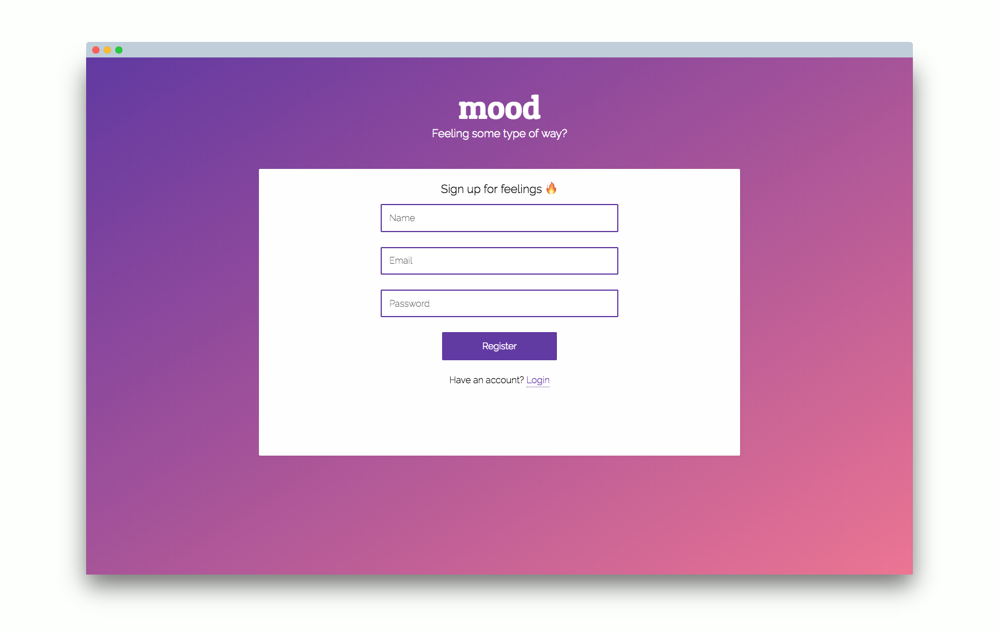

# Smood

Smood is a mood tracker and visualizer. 

Keep track of feels. ALL THE FEELS. 

## Features 

* Aesthetically pleasing UI upon landing  

* Log your moods on your laptop or on the go 

* Keep track of your moods throughout the year on the dashboard 

* Customize your moods and activities to fit your needs. Mix and match with our available emojis 

## Technologies 

**Smood** was built using [ReactJS](https://reactjs.org/) / [Redux](https://redux.js.org/), HTML / CSS, and the following packages and resources: 

* [Passport](http://www.passportjs.org/) - authentication for Node.js

* [Recharts](http://recharts.org/#/en-US/) - charting library 

* [AOS](https://michalsnik.github.io/aos/) - animate on scroll library 

* [Moment](https://www.npmjs.com/package/moment) - Parse, validate, manipulate, and display dates and times in JavaScript

* [EmojiCopy](https://www.emojicopy.com/) - copy and paste emoji library

## Acknowledgements 

* [Kelvin]() - Thank you for putting together one hell of a `json` file for easy emoji rendering. Check out his project [here]() 

## Future Features 

* Calendar tracking 

* Push notifications for reminders 

## Author's Notes  

**Smood** is the product of a passion project assignment at Coalition for Queens. I took this opportunity to experiment with new tools, most notably Redux, Recharts, file structure/organization patterns, and emojis. I wanted to push my limits and get my hands dirty with technologies I've never used before. I wanted to go outside of my usual white-background-clean-font pattern. 

**Smood** is a result of these experimentations. 